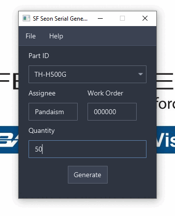

<h1 align="center">
  SF Seon Serial Gen
</h1>

<h4 align="center">A simple semi-automatic solution to creating and securely record keep custom serial numbers for Seon HDD and SSD production.</h4>

  <a href="#key-features">Key Features</a> •
  <a href="#how-to-use">How To Use</a> •
  <a href="#download">Download</a> •
  <a href="#credits">Credits</a> •
  <a href="#related">Related</a> •
  <a href="#license">License</a>

## Key Features

* Reliable record keeping
  - Utilizes Microsoft Access as a database for easy and quick access record keeping
* Automatic serial number generation
  - Automatically generate serial numbers based on part number to avoid duplications and provide a daily rolling serial number to be able to utilize 10000 serial numbers per identifier
* Cross-platform
  - Windows, macOS and Linux ready.

## How To Use

> **Note**
> This is a SafeFleet facility integrated software, not meant for outside use but is open-sourced for utilization in other means.

## Download
> **Note**
> This is a SafeFleet facility integrated software, installation files are kept on the SafeFleet internal network.
---
## Changelog
TODO (v1.5)
* [✓] Bug where serial are not resetting back to 0000 every day
* [✓] Fix performance leak issue
* [✓] Add data look up support

TODO (v2.0)
* Add printing support
* Label format support 
